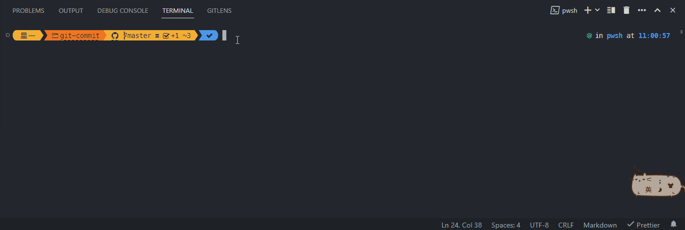

<a href="https://www.yuque.com/star-one/font-end/yynvzwpwtl642i3v?singleDoc" target="_blank">设计文档</a>

# 效果



# 安装

可以使用 node 全局安装

```
npm install -g @star-one/git-commit
```

如果不想全局安装也可以在项目目录下安装

```
npm install -D @star-one/git-commit
```

# 使用

> **前置条件：需要手动暂存想要提交的文件**

如果全局安装使用命令`gec`进入 git commit 流程
如果是项目目录下安装使用命令`npx gec`进入 git commit 流程

# 其他

如果遇到 bug 请在 git 仓库提 issue

仓库 issue 地址：https://github.com/WakerCN/git-commit/issues
